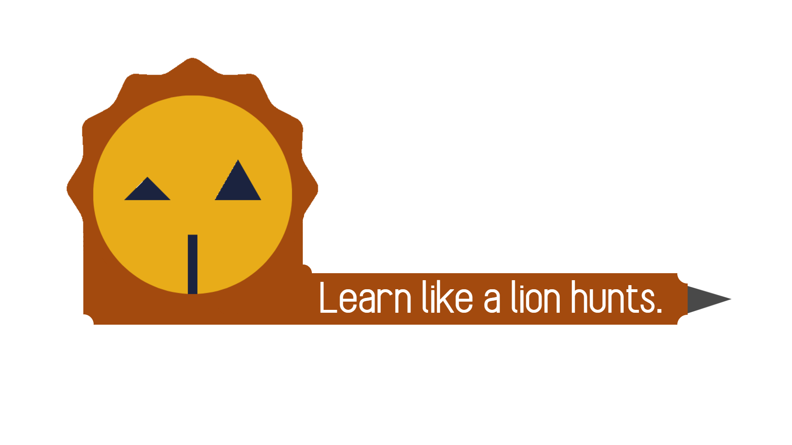
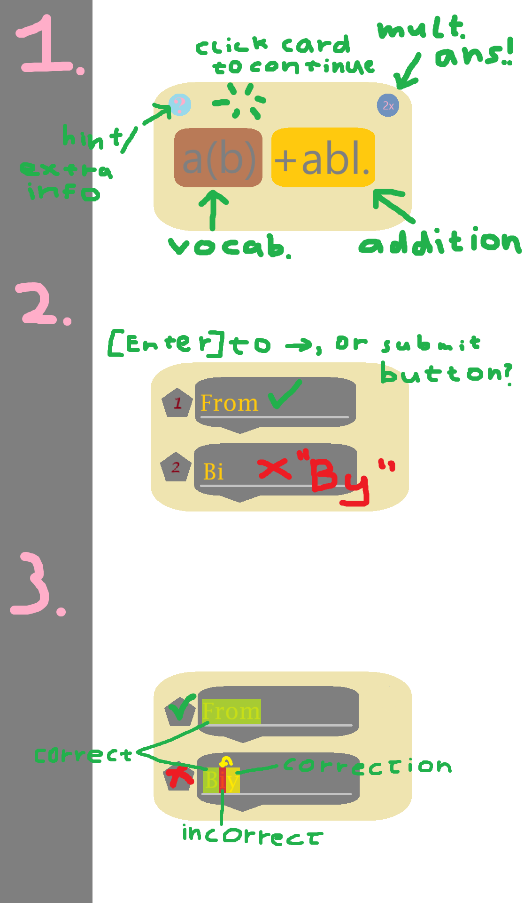
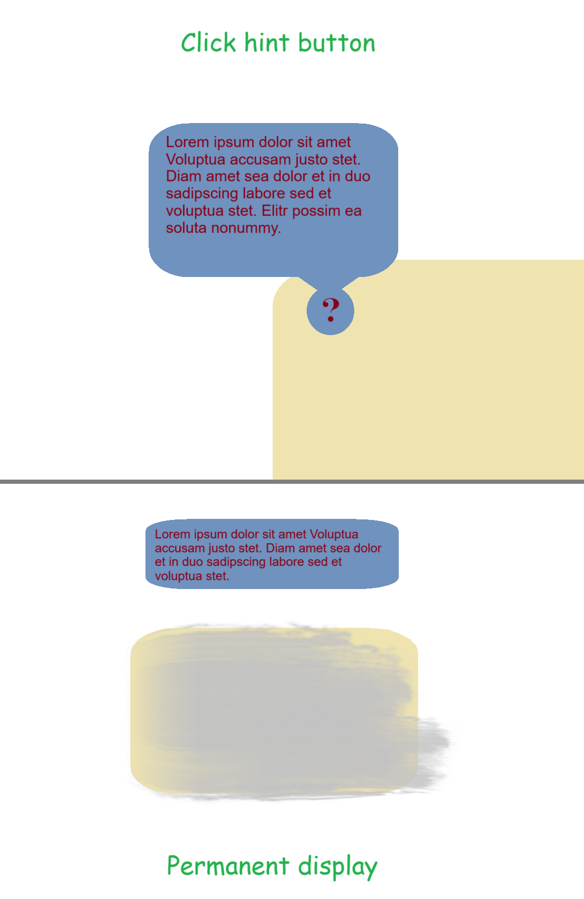
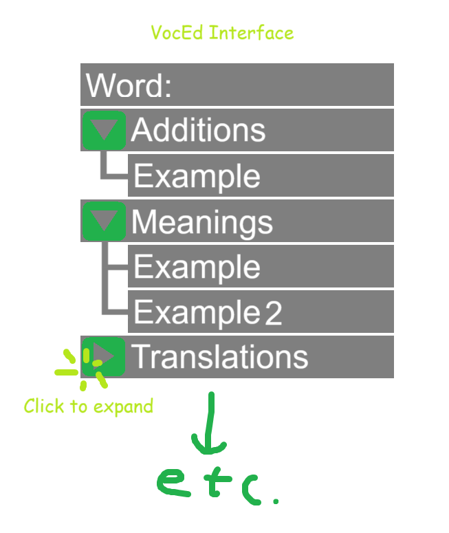
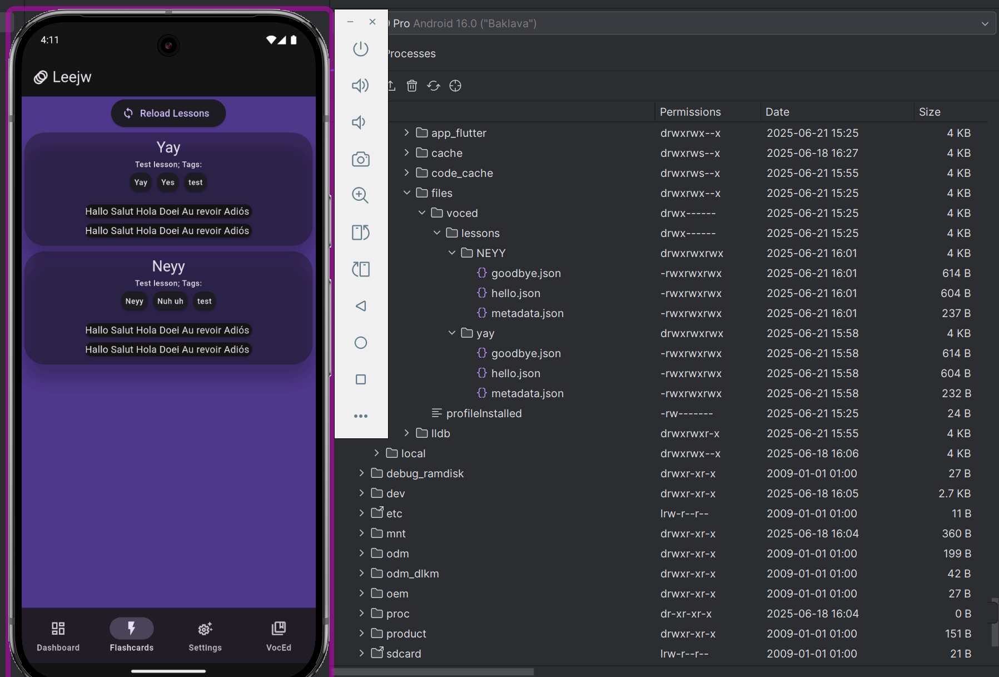

# Leejw 

A brand new way to learn vocabulary, all Open Source and built for students, by a student.

## Getting Started

Leejw is currently not publicly available as a deployment. If you want to use it, clone this repository and [build the app yourself using Flutter](https://docs.flutter.dev/deployment/windows) in whatever way you want. I am opting to make it a **Windows/Mobile app** though!

## Summer of Making

Leejw is being made for the [Summer of Making](https://summer.hack.club/rv) program by Hackclub.

## Concepts

Because of the indev status, here are some of the concepts that will be appearing in Leejw!  

And oh yeah, for your info, Leejw stands for "**Lee**r **j**e **w**oorden," which is Dutch for "Learn your words." But alongside that, it also sounds like the Dutch word for "Lion." That being "Leeuw." Niche bit of trivia isn't it? :D

### Flashcards
The core of Leejw of course lies in the versatile Flashcards system. It displays:  
- [X] The main word.
- [ ] Any additions to the word. If the addition is optional it will have a different color!
- [X] An indicator that is essential for knowing how to format your answer; in this case a `2x` indicating there are two answers to be given.
- [X] A hint/helpful info button, of which the content the users define themselves.
- [X] (2nd page) you insert your answers for the translation/meaning.
- [X] (3rd page) the app checks your answer, grades it and marks what you did wrong if you made a mistake, and then gives a proper correction if it's able to.

These boxes will be ticked as I go on to finish this concept.  

### Donkey bridge

A "donkey bridge" is a Dutch term (Ezelsbruggetje) for a word or phrase that helps you remember things. It's often a joke, absurd thing, or easy to remember fiddle that (in)directly links to the answer you're trying to remember.  

Similarly to Flashcard's hint/useful info button, users make these themselves and can link them to their vocabulary words and invoke the donkey bridge if they're stuck. Alternatively, there will be a setting that allows you to permanently display donkey bridges above your Flashcards to help you solve them!  

The donkey bridge is also partly a design choice. As I was already on the topic of Dutch terms and animals, why not make it the theme of the app?

### Vocabulary Editor (VocEd)

The VocEd can be used to make new words for your vocabulary. You can make sets of words, called "lessons," and you can then in turn put those sets in Flocks.

### Flocks and lessons

A lesson is a group of words from a vocabulary that are related to each other. The most often you'll see this used is if you are for instance referencing a real life study method that also groups their words together.

A flock is a group of lessons, for instance, all the lessons from a singular languages (even though language based lesson collections will be made automatically). Or all the lessons from a real life book or study method.

!! Flocks are scrapped because they have no real use case, but lessons are still very much a thing.

